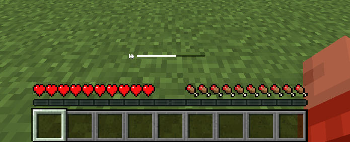

# PlayerStaminaMod
```forge 1.20.1```

Minecraft のプレイヤーにスタミナシステムを導入する Mod です。

スタミナが減少すると、ダッシュ速度が低下し、スタミナが完全に尽きると、ダッシュが不可能になります。

サバイバル時およびクリエイティブ時のダッシュとジャンプによってスタミナを消費します。



## コンフィグ設定

スタミナは最大値が100です。

| パラメータ名	                              | 説明	                                   | デフォルト値 |
|--------------------------------------|---------------------------------------|--------|
| スタミナ回復量 (tickRecoveryRate)	          | 1ティックごとにスタミナ回復量                       | 	0.15  |
| ダッシュ消費量 (tickSprintConsumptionRate)	 | ダッシュ中に1ティックごとに消費されるスタミナ量              | 	0.15  |
| ジャンプ消費量 (jumpConsumption)	           | ジャンプするたびに消費されるスタミナ量                   | 	15.0  |
| 初期スタミナ量 (initStamina)	               | プレイヤーがワールドを初めて読み込んだ際およびリスポーン時のスタミナ量   | 	100.0 |
| 中間閾値 (middleThreshold)	              | スタミナがこの値を下回ると、ゲージが黄色になり速度が低下します。      | 	33.3  |
| ダッシュ速度倍率 (sprintSpeedMultiplier)	    | スタミナが黄色になった際のダッシュ速度倍率。0.85は歩行速度とほぼ同じ。 | 	0.85  |

## コマンド形式
### 基本形式
```
/stamina <parameter> [value]
```

| コマンド例	                                  | 説明                     |
|-----------------------------------------|------------------------|
| /stamina tickRecoveryRate	              | 現在のスタミナ回復量を表示します。      |
| /stamina tickRecoveryRate 0.20	         | スタミナ回復量を 0.20 に設定します。  |
| /stamina tickSprintConsumptionRate      | 	現在のダッシュ消費量を表示します。     |
| /stamina tickSprintConsumptionRate 0.10 | 	ダッシュ消費量を 0.10 に設定します。 | 
| /stamina jumpConsumption	               | 現在のジャンプ消費量を表示します。      |
| /stamina jumpConsumption 8.0	           | ジャンプ消費量を 8.0 に設定します。   |
| /stamina initStamina	                   | 現在の初期スタミナ量を表示します。      |
| /stamina initStamina 80.0	              | 初期スタミナ量を 80.0 に設定します。  |
| /stamina middleThreshold	               | 現在の中間閾値を表示します。         |
| /stamina middleThreshold 25.0           | 中間閾値を 25.0 に設定します。     |
| /stamina sprintSpeedMultiplier          | 現在のダッシュ速度倍率を表示します。     |
| /stamina sprintSpeedMultiplier 0.75     | ダッシュ速度倍率を 0.75 に設定します。 |
